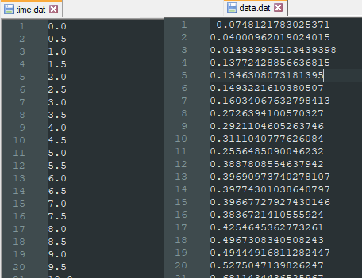

<p align="center">
  
</p> 

[](https://github.com/samirmartins/pydaq)
[](https://opensource.org/licenses/BSD-3-Clause)
[](https://github.com/samirmartins/pydaq/issues)
[](https://github.com/samirmartins/pydaq/issues)
[](https://pypi.org/project/pydaq/)
[](https://pypi.org/project/pydaq/)
[](https://pypi.org/project/pydaq/)
[](https://github.com/samirmartins/pydaq/graphs/contributors)
[](https://github.com/samirmartins/pydaq/network/members)
[](https://github.com/samirmartins/pydaq/stargazers)


# PYDAQ - Data Acquisition and Experimental Analysis with Python


----
Using Python for applications with experimental data (NIDAQmx)
----

This project uses python for data acquisition and empirical experiments. 
It was firstly designed to be used as a data acquisition system 
when acquiring data for a step-response experiment. 

Despite this, one can use PYDAQ to acquire signal from 
any system, using different boards [(check examples folder)](examples), 
without any line of code. 

The code provided here allows user to save acquired data in .dat files in 
a path specified by the user (or at Desktop, if no path is provided)

You can find below some examples from the GUI (Graphical 
User Interface).

---
Quick view
---





---
To install:
---

Just as another Python package, run:

```python
pip install pydaq
```

---
To use (more details in [examples](examples)):
---

Graphical User Interface (NIDAQmx):

```python
from pydaq.get_data import Get_data

g = Get_data()
g.get_data_nidaq_gui()
```

Command line (NIDAQmx):

```python
from pydaq.get_data import Get_data

g = Get_data("Dev1", "ai0", 0.5, 10.0, True, "C:\\Users\\Samir\\Desktop", True)
g.get_data_nidaq()
```