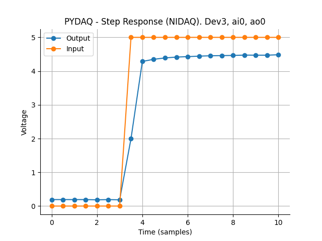
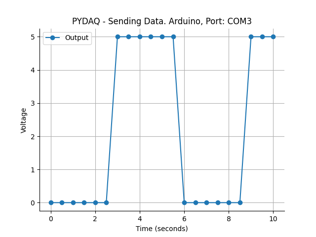

<p align="center">
  
</p> 

[](https://github.com/samirmartins/pydaq)
[](https://opensource.org/licenses/BSD-3-Clause)
[](https://pypi.org/project/pydaq/)
[](https://pypi.org/project/pydaq/)
[](https://github.com/samirmartins/pydaq/graphs/contributors)
[](https://github.com/samirmartins/pydaq/network/members)
[](https://github.com/samirmartins/pydaq/stargazers)
<!--- 
[](https://github.com/samirmartins/pydaq/issues)
[](https://github.com/samirmartins/pydaq/issues)
[](https://pypi.org/project/pydaq/)
-->

# PYDAQ - Data Acquisition and Experimental Analysis with Python


----
Using Python for applications with experimental data (Arduino and NIDAQ boards)
----

This package was firstly designed to use experimental device for data 
acquisition and signal generator, when performing different experiment, 
such as a step-response test. 

Despite this, one can use PYDAQ to acquire and send a signal from 
any system, using different boards [(check jupyter notebook examples folder)](examples), 
through a Graphical User Interface or via command line. In this sense
the user is capable to generate a customized signal which can be easily
applied to a system. 

It is noteworthy that this application makes data acquisition and 
empirical experiments simpler, faster and easier. This is relevant
when the user needs empirical data to construct black box linear and
nonlinear models, commomly used in research projects in forecasting and 
model-based control schemes.
 
The code provided here allows user to save acquired data in .dat files in 
a path specified by the user (or at Desktop, if no path is provided), as well
as send a user-defined data, which can be any nonlinear input signal 
[(you are strongly advised to check the )](https://samirmartins.github.io/pydaq/)

In what follows you will find

- Installation and Requirements
- Quick view and Main features 
- Using Graphical User Interfaces
- Screenshots


---
Installation and Requirements
---

The fastest way to install PYDAQ is using pip:

```console
pip install pydaq
```

PYDAQ requires:

- Installed driver of the board used (Arduino or National Instruments NIDAQ)
- nidaqmx (>=0.6.5) for data acquisition from National Instruments Boards
- matplotlib (>=3.5.3) as a visualization tool
- numpy (>=1.22.3) to process data
- PySimpleGUI (>=4.60.3) as a Graphical User Interface
- PyQt5 as a backend for PySimpleGui
- pyserial (>=3.5) to manage data to/from Arduino


---
Quick view and Main features
---

| Feature                      |                                                                                                                                                                                                                                          Description |
|------------------------------|-----------------------------------------------------------------------------------------------------------------------------------------------------------------------------------------------------------------------------------------------------:|
| Send Data (NIDAQ)            |                                                                                                                                                   This feature allows the user to send data through any NIDAQ board using a graphical user interface |
| Send Data (Arduino)          |                                                                                                                                               This feature allows the user to send data through any Arduino board through a graphical user interface |
| Get Data (NIDAQ)             |                                        Here the user is able to get data from a NIDAQ board, using any terminal configuration (Diff, RSE, NRSE), sample time and other parameters. Acquired data can also be saved and plot for further applications |
| Get Data (Arduino)           |                                                                                                    Here the user is able to get data from an Arduino board, using several options. Acquired data can also be saved and plot for further applications |
| Step Response (NIDAQ) |   In this feature one can perform an automatic step response experiment using a NIDAQ board. Data genereted by the experiment can also be saved to be used in further applications, such as obtaining linear and nonlinear models from acquired data |
| Step Response (Arduino)      | In this feature one can perform an automatic step response experiment using an Arduino. Data genereted by the experiment can also be saved to be used in further applications, such as obtaining linear and nonlinear models from acquired data |
 

---
Using GUIs (more details in [documentation](https://samirmartins.github.io/pydaq/) and [jupyter notebook examples](examples)):
---

#### Data acquisition (NIDAQ):

```python
from pydaq.get_data import Get_data
g = Get_data()
g.get_data_nidaq_gui()
```

#### Data acquisition (Arduino):

```python
from pydaq.get_data import Get_data
g = Get_data()
g.get_data_arduino_gui()
```

#### Sending data (NIDAQ):

```python
from pydaq.send_data import Send_data
s = Send_data()
s.send_data_nidaq_gui()
```

#### Sending data (Arduino):

```python
from pydaq.send_data import Send_data
s = Send_data()
s.send_data_arduino_gui()
```

#### Step response (NIDAQ):

```python
from pydaq.step_response import Step_response
s = Step_response()
s.step_response_nidaq_gui()
```

#### Step response (Arduino):

```python
from pydaq.step_response import Step_response
s = Step_response()
s.step_response_arduino_gui()
```

---
Screnshots
---

### Graphical User Interfaces - NIDAQ


### Graphical User Interfaces - Arduino


### Acquired/Sending data and step response - NIDAQ and Arduino








### Data in .dat format


