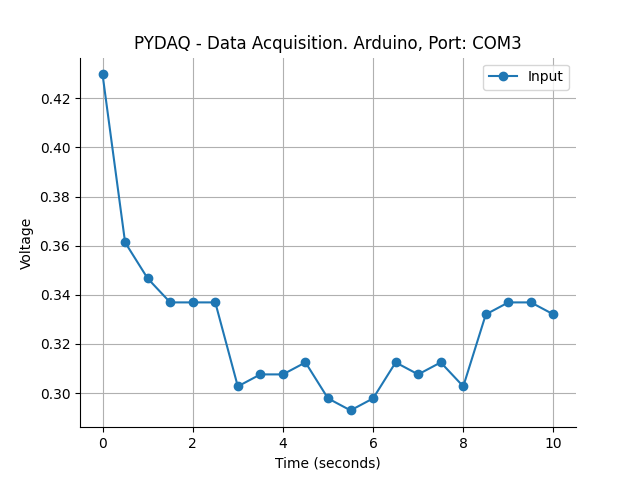

<p align="center">
  
</p> 

[](https://github.com/samirmartins/pydaq)
[](https://opensource.org/licenses/BSD-3-Clause)
[](https://pypi.org/project/pydaq/)
[](https://pypi.org/project/pydaq/)
[](https://github.com/samirmartins/pydaq/graphs/contributors)
[](https://pypi.org/project/pydaq/)
[](https://github.com/samirmartins/pydaq/issues)
[](https://github.com/samirmartins/pydaq/issues)
[](https://github.com/samirmartins/pydaq/network/members)
[](https://github.com/samirmartins/pydaq/stargazers)


# PYDAQ - Data Acquisition and Experimental Analysis with Python


----
Using Python for applications with experimental data (Arduino and NIDAQ boards)
----

This package was firstly designed to use experimental device for data 
acquisition and signal generator, when performing different experiment, 
such as a step-response test. 

Despite this, one can use PYDAQ to acquire and send a signal from 
any system, using different boards [(check jupyter notebook examples folder)](examples), 
through a Graphical User Interface or via command line. In this sense
the user is capable to generate a customized signal which can be easily
applied to a system. 

It is noteworthy that this application makes data acquisition and 
empirical experiments simpler, faster and easier. This is relevant
when the user needs empirical data to construct black box linear and
nonlinear models, commomly used in research projects in forecasting and 
model-based control schemes.
 
The code provided here allows user to save acquired data in .dat files in 
a path specified by the user (or at Desktop, if no path is provided), as well
as send a user-defined data, which can be any nonlinear input signal 
[(you are strongly advised to check the )](https://samirmartins.github.io/pydaq/)

In what follows you will find

- Installation and Requirements
- Quick view and Main features 
- Using Graphical User Interface
- Screenshots


---
Installation and Requirements
---

The fastest way to install PYDAQ is using pip:

```console
pip install pydaq
```

**NOTE:** In this version of pydaq (0.0.3), [(NI-DAQmx drivers)](https://www.ni.com/en/support/downloads/drivers/download.ni-daq-mx.html#494676) must be installed, even if 
the user is only using Arduino Boards. This issue will be addressed in future versions, allowing
Arduino users to use PYDAQ without having to install NI-DAQmx drivers.

PYDAQ requires:

- Installed driver of the board used (Arduino or National Instruments NIDAQ)
- nidaqmx (>=0.6.5) for data acquisition from National Instruments Boards
- matplotlib (>=3.5.3) as a visualization tool
- numpy (>=1.22.3) to process data
- PySide6 (>=6.7.1), PySide6_Addons, PySide6_Essentials and shiboken6 as a Graphical User Interface framework
- pyserial (>=3.5) to manage data to/from Arduino


---
Quick view and Main features
---

| Feature                      |                                                                                                                                                                                                                                          Description |
|------------------------------|-----------------------------------------------------------------------------------------------------------------------------------------------------------------------------------------------------------------------------------------------------:|
| Send Data (NIDAQ)            |                                                                                                                                                   This feature allows the user to send data through any NIDAQ board using a graphical user interface |
| Send Data (Arduino)          |                                                                                                                                               This feature allows the user to send data through any Arduino board through a graphical user interface |
| Get Data (NIDAQ)             |                                        Here the user is able to get data from a NIDAQ board, using any terminal configuration (Diff, RSE, NRSE), sample time and other parameters. Acquired data can also be saved and plot for further applications |
| Get Data (Arduino)           |                                                                                                    Here the user is able to get data from an Arduino board, using several options. Acquired data can also be saved and plot for further applications |
| Step Response (NIDAQ) |   In this feature one can perform an automatic step response experiment using a NIDAQ board. Data genereted by the experiment can also be saved to be used in further applications, such as obtaining linear and nonlinear models from acquired data |
| Step Response (Arduino)      | In this feature one can perform an automatic step response experiment using an Arduino. Data genereted by the experiment can also be saved to be used in further applications, such as obtaining linear and nonlinear models from acquired data |
 

---
Using GUI (more details in [documentation](https://samirmartins.github.io/pydaq/) and [jupyter notebook examples](examples)):
---

In the latest version, all functionalities for all boards are incorporated in one single window.

### Launching the GUI:

```python
from pydaq.pydaq_global import PydaqGui

PydaqGui()
```

---
Screnshots (v0.0.4)
---

### Graphical User Interfaces - NIDAQ


### Graphical User Interfaces - Arduino


### Acquired/Sending data and step response - NIDAQ and Arduino




### Data in .dat format


---
Contributing
---

You are more than welcome to make your contribution and submit a pull request. To contribute, [read this guide](/CONTRIBUTING.md).


---
CITATION
---
[](https://doi.org/10.21105/joss.05662)

If you are using PYDAQ on your project, you can cite us as following: 

- Martins, S. A. M. (2023). PYDAQ: Data Acquisition and Experimental Analysis with Python. Journal of Open Source Software, 8(92), 5662. https://doi.org/10.21105/joss.05662

```bibtex
@article{Martins_PYDAQ_Data_Acquisition_2023,
  author = {Martins, Samir Angelo Milani},
  doi = {10.21105/joss.05662},
  journal = {Journal of Open Source Software},
  month = dec,
  number = {92},
  pages = {5662},
  title = {{PYDAQ: Data Acquisition and Experimental Analysis with Python}},
  url = {https://joss.theoj.org/papers/10.21105/joss.05662},
  volume = {8},
  year = {2023}
}
```
