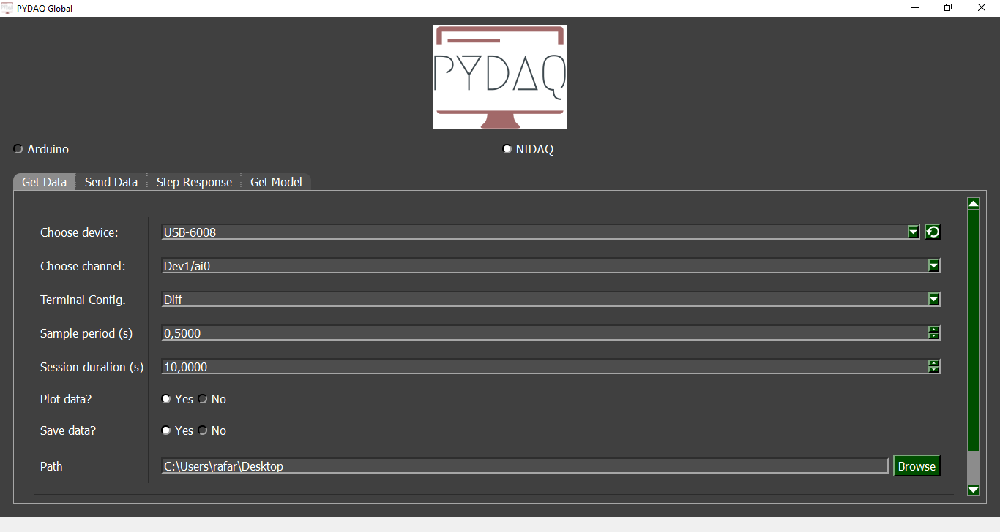
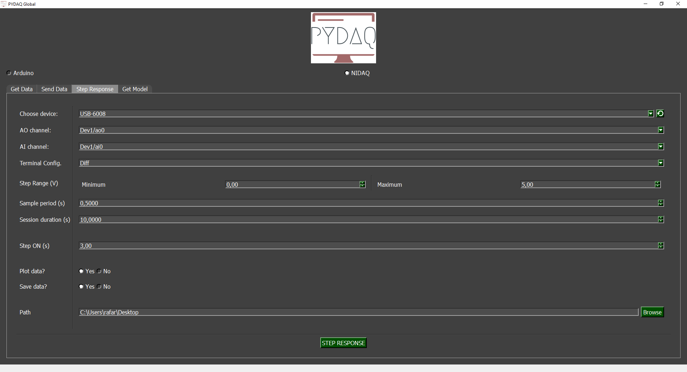
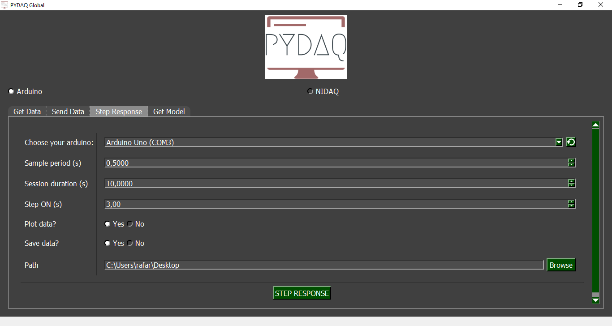
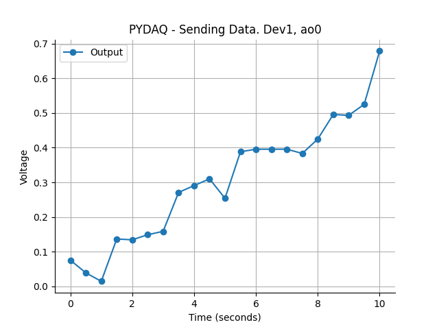

# Summary


# PYDAQ - Data Acquisition and Experimental Analysis

# Examples

Figures \autoref{fig:arduino_get_gui} and \autoref{fig:nidaq_get_gui} depicts
the Graphical User Interface developed for Data Acquisition using Arduino or any NIDAQ board.

{ width=20%, height=20%}

{ width=20%, height=20%}

To start them, only three line of codes (LOC) are necessary, including one for importing PYDAQ: 

```python
from pydaq.get_data import Get_data
# Class Get_data
g = Get_data()

# Arduino or NIDAQ - Use one of the following lines
# g.get_data_nidaq_gui() # For NIDAQ devices 
# g.get_data_arduino_gui() # For arduino boards
```

Similarly, to send data, only three LOC are required, as showed up in what follow:

```python
from pydaq.send_data import Send_data

# Class Send_data
s = Send_data()

# Arduino or NIDAQ - Use one of the following lines
# s.send_data_nidaq_gui()
# s.send_data_arduino_gui()
```

If the user decides to save data, it will be saved in .dat format, located at the 
path defined in the GUI. Figure \label{fig:data} shows an example of how data will be saved: i) one file (time.dat) 
with the timestamp, in seconds, when each sample was acquired; ii) file data.dat containing acquired values.

{ width=20%, height=20%}

{ width=20%, height=20%}

{ width=20%, height=20%}


It should be emphatized that once this code is executed, a Graphical User Interface will
manifest on screen, acording to the board selected by the user, as 
shown in Figures \autoref{fig:nidaq_send_gui} and \autoref{fig:arduino_send_gui}.

Options are straigh-forward and ease to understand. For further details and to check 
how to use the same functionality using a command line the reader are invited to 
read the documentation (https://samirmartins.github.io/pydaq/). 

It is noteworthy that any signal can be generated and applied to a physical
system using the presented GUI, being the used board the main constraint. Data
can be either generated manually or using a library (e.g, numpy) to create 
signals as sine waves, PRBS (Pseudo-Random Binary Signal) or other signal 
required to be a persistently exciting input, as necessary for system identification [@Lju1987], [@Bil2013]  

Step-response is a common way to test a system and acquire data, in order to find a model, as well
as system time constant and gain. To facilitate this procedure, a step-response GUI
was also created and can be seen in Figures \label{fig:step_nidaq} and  \label{fig:step_arduino}.

{ width=20%, height=20%}

{ width=20%, height=20%}

Here the user can define when the step will be applied, as well as where data will be saved.
Figures \label{fig:data_sent} and \label{fig:step_data} shows data that were empirically-acquired 
with PYDAQ. In the figures the user will find lables, function (Sending Data/Data Acquisition/Step Response), 
device/channel (for NIDAQ boards) or COM port used (for Arduino devices).


{ width=20%, height=20%}

{ width=20%, height=20%}


Examples showed above shed light in some functionalities of PYDAQ. For further 
details and for command line use, reader is welcome to consult full 
documentation (https://samirmartins.github.io/pydaq/).


# Future Work

Future releases will include real-time and data-driven system identification using linear and nonlinear approaches.
Also, real-time model based controllers will be implemented through PYDAQ. Saving data 
in a SQL server is a future feature, as well.

# References