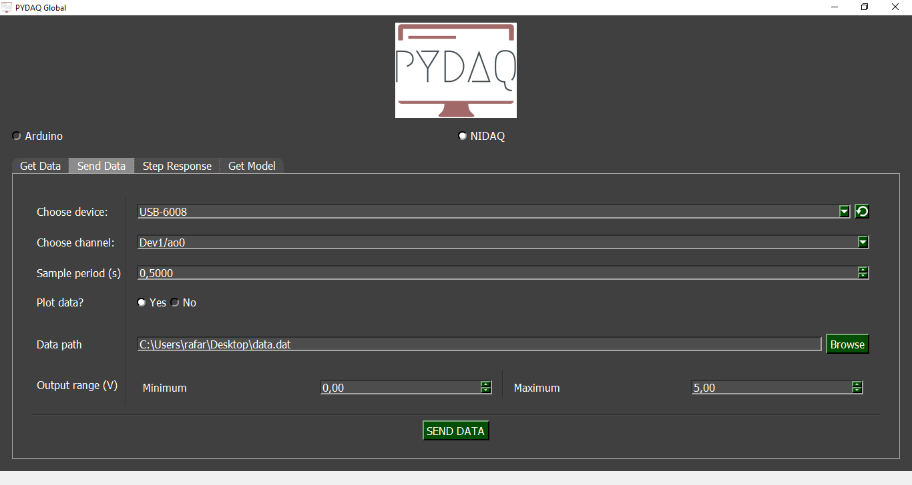

# Summary

# PYDAQ - Data Acquisition and Experimental Analysis

# Examples

{ width=20%, height=20%}

{ width=20%, height=20%}

{ width=20%, height=20%}

{ width=20%, height=20%}

{ width=20%, height=20%}

{ width=20%, height=20%}

{ width=20%, height=20%}

{ width=20%, height=20%}

{ width=20%, height=20%}

\autoref{fig:example}

# Future Work

Future releases will include real-time and data-driven system identification using linear and nonlinear approaches.
Also, real-time model based controllers will be implemented through PYDAQ. Saving data 
in a SQL server is a future feature, as well.

# References